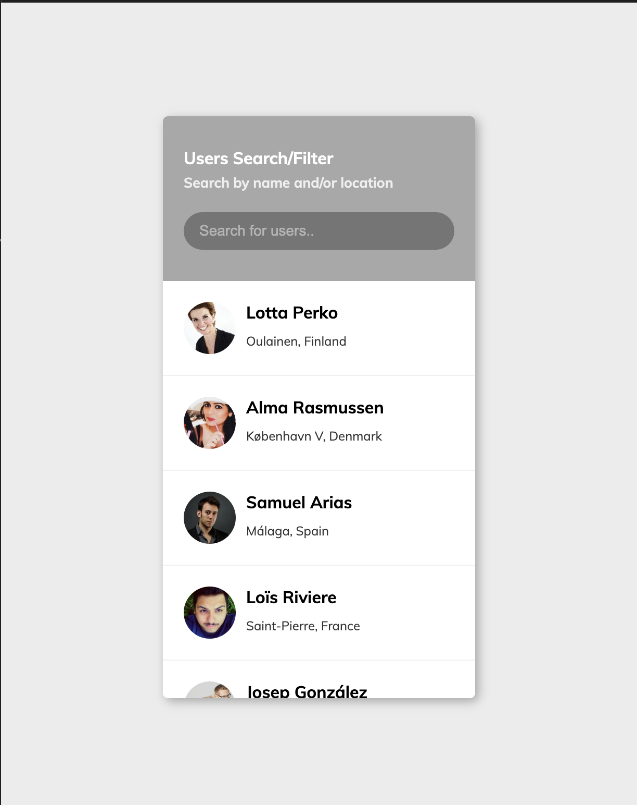

# Users-Search/Filter



An interactive web application that allows users to search and filter through a list of user profiles fetched from an API. Built with HTML, CSS, and JavaScript, this project demonstrates how to dynamically display and filter data in real-time, creating an engaging and responsive user interface.

## Key Features
- **Search Functionality**: Search users by their first or last name with real-time filtering.
- **Dynamic Data Fetching**: Retrieves a list of users from the [Random User API](https://randomuser.me/) for a dynamic and fresh experience.
- **Responsive UI**: A clean and minimalist design that works seamlessly across devices.
- **User Profiles**: Displays user details, including name, location, and profile picture.

## Technologies Used
- **Frontend**: HTML, CSS (with modern styling for a sleek design).
- **JavaScript**: Handles data fetching, filtering, and dynamic content rendering.
- **API**: Fetches data from the [Random User API](https://randomuser.me/).

## How to Run
1. Clone the repository:
   ```bash
   git clone https://github.com/yourusername/Users-Search.Filter.git
   cd Users-Search.Filter
   ```
2. Open `index.html` in your browser to start using the application.

## Live Demo
Check out the live[ Demo ](https://chrisroland.github.io/Users-Search.Filter/)

## Contributions
- Feel free to **open issues** if you encounter bugs or have feature suggestions.
- **Pull requests** are welcome for new features or enhancements.
- This project is **open-sourced**, and I welcome **constructive feedback** and **collaborations**!

Thank you for exploring this project! ❤️